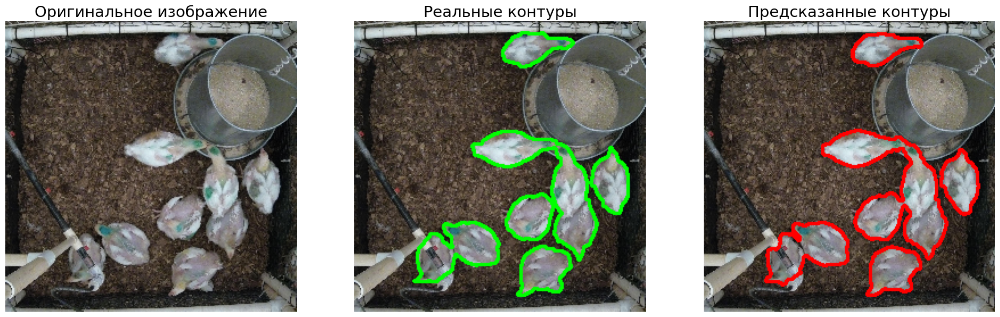

# Сегментация кур на изображениях

Целью проекта является разработка и обучение модели глубокого обучения для точной пиксельной сегментации кур на изображениях, что может быть использовано для автоматизированного мониторинга поголовья в птицеводстве.

### Особенности датасета:

*   **Задача:** Семантическая сегментация.
*   **Формат разметки:** Координаты полигонов в текстовых файлах.
*   **Объем:** ~1,141 пара "изображение-разметка".
*   **Особенность:** Необходимость преобразования полигональной разметки в бинарные маски для обучения.

### Технологический стек

*   **Python**
*   **TensorFlow / Keras**: Основной фреймворк для построения и обучения модели.
*   **segmentation-models**: Библиотека с готовыми архитектурами (U-Net) и утилитами для задач сегментации.
*   **Albumentations**: Мощная библиотека для аугментации изображений и масок.
*   **OpenCV**: Для обработки изображений и создания масок из полигонов.
*   **Scikit-learn**: Для разделения данных на выборки.
*   **NumPy**: Для численных операций.
*   **Matplotlib**: Для визуализации данных и результатов.

### Содержание проекта

#### 1. Подготовка и предобработка данных

*   **Парсинг разметки:** Создана функция для преобразования текстовых файлов с координатами полигонов в бинарные маски сегментации.
*   **Разделение данных:** Датасет был разделен на обучающую (80%), валидационную (10%) и тестовую (10%) выборки для объективной оценки модели.
*   **Создание пайплайна:** Для эффективной загрузки и обработки данных в процессе обучения.

#### 2. Аугментация данных

Для повышения устойчивости модели к различным условиям съемки и предотвращения переобучения был применен широкий спектр аугментаций с помощью библиотеки `Albumentations`:

*   Геометрические преобразования: случайные отражения, повороты, сдвиги и масштабирование.
*   Морфологические искажения: эластичные деформации, искажения сетки.
*   Изменения цвета и яркости: случайное изменение яркости, контраста и гаммы.

#### 3. Разработка и обучение модели

В качестве основной архитектуры была выбрана **U-Net** с предобученным энкодером **MobileNetV2**.

**Стратегия обучения (Fine-Tuning):**
1.  **Заморозка энкодера:** На первом этапе обучались только слои декодера, чтобы адаптировать их к новой задаче на более высокой скорости обучения.
2.  **Разморозка всей модели:** На втором этапе вся модель была разморожена для "тонкой настройки" на очень низкой скорости обучения, что позволило улучшить общую производительность.

#### 4. Контроль обучения

Для автоматизации и оптимизации процесса обучения использовались стандартные коллбеки Keras:

*   `ModelCheckpoint`: Сохранение лучшей версии модели на основе метрики `val_iou_score`.
*   `EarlyStopping`: Предотвращение переобучения путем ранней остановки, если метрика на валидации перестает улучшаться.
*   `ReduceLROnPlateau`: Адаптивное снижение скорости обучения для более точной настройки весов.

### Результаты

Финальная модель была оценена на отложенной тестовой выборке и показала следующие результаты:

*   **Test IoU Score: 0.9077**
*   **Test Pixel-wise Accuracy: 98.22%**
*   **Test Loss: 0.0955**

**История обучения**

**Примеры предсказаний**

### Выводы из результатов:

*   **Высокая точность сегментации:** Метрика **Intersection over Union (IoU)**, равная **~0.91**, свидетельствует о том, что предсказанные моделью маски почти идеально совпадают с реальной разметкой.
*   **Надежность модели:** Высокая точность на тестовой выборке, которую модель не видела в процессе обучения, подтверждает ее хорошую обобщающую способность и устойчивость к новым данным.
*   **Практическая применимость:** Разработанное решение полностью выполняет поставленную задачу и может быть использовано как основа для системы автоматического мониторинга кур, подсчета их количества и анализа поведения.